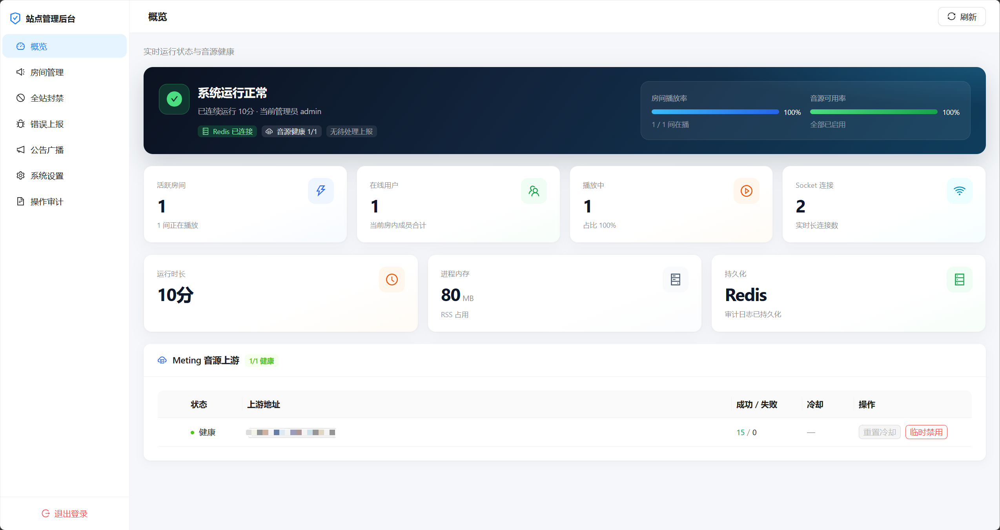

<h1 align="center">🎵 OpenMusic</h1>

<p align="center">
  <strong>多人实时在线点歌</strong><br/>
  多音源搜索 · 同步听歌 · 聊天互动 · 3D 视觉 / 沉浸模式
</p>

<p align="center">
  
  
  
</p>

<p align="center">
  <a href="#-快速开始">🚀 快速开始</a> ·
  <a href="#-功能概览">✨ 功能</a> ·
  <a href="#-站点管理后台">🛡️ 管理后台</a> ·
  <a href="docs/DEPLOY.md">📖 部署文档</a> ·
  <a href="deploy/DEPLOY-BAOTA.md">🛠️ 宝塔部署</a>
</p>

---

## 📸 项目截图

| 房间大厅 | 房间点歌 | 歌词播放 | 管理后台 |
|:---:|:---:|:---:|:---:|
|  |  |  |  |

---

## 🚀 快速开始

> 要求：Node.js ≥ 18 + 一个 Redis（必需）

💡 **一键部署**：`bash deploy/deploy.sh`，交互选择 Docker（自带 Redis）或源码（PM2）部署，详见 [部署文档](docs/DEPLOY.md#一键部署脚本)。下面是手动分步流程。

### 1. 准备音源（Meting-API）

```bash
docker run -d --name meting -p 3000:3000 w3126197382/meting-api:latest
```

容器自带管理页 `http://localhost:3000/admin`（默认 `admin` / `admin123`），登录后配置红点渠道 Cookie。

### 2. 启动 OpenMusic

```bash
git clone https://github.com/wqqqqqq200/openmusic.git
cd openmusic
npm run install:all
npm run build
npm start                            # http://0.0.0.0:4000
```

浏览器打开后会自动进入**部署向导**，在页面里填写 Redis 连接、Meting 音源地址、站点地址即可。向导会自动生成会话密钥、随机管理入口和**随机管理员账号密码**，并写好配置文件——**全程无需手动编辑 `.env`**。请在完成页立刻复制账号信息，重启服务后用向导给出的管理入口登录。

> 迟言（蓝点）、七牛（发图）、接口盒子（表情 / 敏感词兜底）等可选服务，登录管理后台 →「运行配置」随时增删改，同样无需改文件。

开发模式（前后端热更新）：`npm run dev`（前端 `:5173`，后端 `:4000`）。

> 生产由**同一 Node 进程**托管 API、WebSocket 与前端静态资源。**Redis 为必需依赖**；房间实时状态在进程内存热缓存、持久化只写 Redis，请保持单实例。进阶部署（Nginx / 宝塔 / Docker / 多上游负载均衡）见 [docs/DEPLOY.md](docs/DEPLOY.md)。

---

## ✨ 功能概览

### 🎧 听歌

- 多音源搜索：红点 / 绿点 / 蓝点，自选音质
- 多人实时同步播放、歌词滚动
- 网易云热歌榜（服务端缓存每 3 小时刷新；封面使用原图）
- 歌单导入、个人收藏与点歌历史（JSON 导入 / 导出）
- TV 大屏：`/tv/:roomId`
- 队列拖拽排序、媒体键（耳机 / 锁屏控件）
- 移动端后台播放（Capacitor）

### 🏠 房间

- 大厅、密码房、最近访问、分享链接（密码可直达）
- 首页站点公告：在管理后台编辑与启停（Redis 持久化）；勾选「作为新公告发布」可让已读用户重新弹窗
- 房间公告、FM 漫游、贵宾角标、聊天历史可见性
- 成员归属地：进房时由客户端查询并上报（[uapis myip](https://uapis.cn/api/v1/network/myip)），本地缓存；新成员进房后其归属地实时广播给房内其他人，失败不影响进房
- 点歌规则、禁播、踩歌切歌、离房清歌
- 纯净模式：隐藏动效与热榜，标签页低调伪装

### 💬 互动

- 实时聊天：贴纸、发图、点评、回复 / @ / @全体、消息撤回
- 敏感词：前端快速检测（[uapis](https://uapis.cn/api/v1/text/profanitycheck)）通过后签发密令，后端验密令可跳过慢接口；失败 / 积分不足自动走接口盒子兜底
- 发图时服务端图片审核（`CYAPI_KEY`）；发送中显示「违禁词检测中 / 图片监测中」进度
- 微信表情包采集（本机 IndexedDB，单张 ≤ 5MB）
- 表情包搜索（接口盒子，可选）

### 🌌 视觉与客户端

- 星河 / 声波地形等 3D 背景与桌面沉浸模式
- 沉浸模式：长歌词自适应（换行 / 缩小），浏览器原生全屏按钮（Esc 同步退出）
- Android / iOS（Capacitor 远程 URL 壳，前端发版无需重打包）
- 发版更新：轮询 `/api/app-version`；`forcePrompt=true` 时弹窗「立即更新」硬刷新，非紧急可静默发版；同一版本不重复强弹

### ⚙️ 点歌规则（房主 / 管理员）

房间设置 → **点歌**：

| 规则 | 说明 |
|------|------|
| 允许成员点歌 | 关闭后仅房主与管理员可点 |
| 允许成员插队 | 成员可对自己的点歌插队；管理始终可 |
| 进房等待时间 | 新成员停留满时长后才能点歌 |
| 每人最多点歌 | 队列中每人上限（含正在播放），`0` = 不限 |
| 点歌冷却 | 不限制 / 10s / 30s / 60s / 120s |
| 队列长度上限 | 50 / 100 / 200 |
| 禁播歌曲 | 按歌名；同名跨平台均不可点 |
| 踩歌切歌 | 按人数或在线比例切掉当前曲 |
| 退出后清除已点 | 离房超时后清除其待播 |

---

## 🛡️ 站点管理后台

首次部署向导会在 Redis 创建**随机管理员账号密码**，并随机生成管理入口（**不是**固定的 `/admin`）。账号密码仅在完成页展示一次，请立即收藏；也可登录后在面板自行修改。

### 登录地址与忘记密码

| 忘了什么 | 去哪找 / 怎么处理 |
|----------|-------------------|
| **登录面板地址后缀** | 打开服务器上的 `server/adminConfig.json`，看字段 `entryPath`（例如 `"/xK9m…"`）。完整地址 = 站点域名 + 该后缀，如 `https://你的域名.com/xK9m…`。向导完成页也会展示一次，请自行收藏。 |
| **管理员账号名** | Redis 键 `openmusic:admin:credentials` 的 JSON 里有明文 `username`（可用 `redis-cli GET openmusic:admin:credentials` 查看）。 |
| **管理员密码** | 只存 scrypt 哈希，**无法从磁盘或 Redis 还原明文**。若已遗忘：删除该 Redis 键后重启服务，会重新初始化为默认 `admin` / `123456`，再登录后立即改密。 |

```bash
# 查看当前登录路径后缀
cat server/adminConfig.json

# 忘记密码时重置（会回到默认 admin / 123456，且须强制改密）
redis-cli DEL openmusic:admin:credentials
# 然后重启 OpenMusic 进程
```

- **登录**：输入账号密码，服务端签发 `HttpOnly` 会话 Cookie（`SameSite=Strict`，生产带 `Secure`）；进程重启或退出登录即失效
- **修改账号密码**：登录后可在面板修改；密码以 scrypt 哈希存 Redis（不写磁盘文件）；改密接口有 IP 限流；修改后其它已登录会话立即失效
- **登录地址自定义**：后台可把入口改成随机路径（旁边刷新按钮一键生成），旧地址随即失效；配置写入 `server/adminConfig.json`（该文件已在 `.gitignore` 中，勿提交到仓库）
- **防爆破**：每 IP 登录限流 + 连续失败逐步加长锁定（1m → 2m → 4m … 封顶 1h）
- **运行配置**：音源（Meting）、迟言、七牛发图、接口盒子、空房销毁时长等均在后台在线编辑，密钥类字段加密存储，无需改文件重启
- **总览**：房间数、在线人数、Socket 连接、运行时长、内存、持久化存储（Redis）、Meting 上游健康面板（可手动重置冷却 / 临时禁用）
- **房间管理**：全量房间列表（含大厅隐藏房）、一键强制解散并踢出成员
- **房间保活**：可指定房间跳过无人超时销毁；Redis 保存保活名单，管理员仍可手动强制解散
- **全局广播**：向所有房间发送系统通知（写入聊天记录并弹出提示）
- **全站封禁**：按 IP / deviceId 封禁，禁止进房与建房；封禁时踢出在线匹配连接
- **错误上报**：房间底栏可提交问题描述；服务端附带前端 Debug 快照与近期事件；后台可查看、标记已处理、删除（Redis 持久化，最多保留 100 条）
- **操作审计**：登录 / 退出 / 改登录地址 / 解散房间 / 广播 / 封禁 / 错误上报处理等均记录（含 IP）；写入 Redis（保留最近 500 条）

> 建议：生产环境首次用长随机密码引导，登录后立刻在面板改掉；并可在 Nginx 侧对入口再加 IP 白名单或 Basic Auth 作为第二层防护。

---

## 😺 微信表情包

1. 表情面板 →「微信表情包」→「开始采集」
2. 微信扫码登录文件传输助手
3. 把表情发到文件传输助手，网页端自动入库
4. 面板中点击即可发送

| 项目 | 说明 |
|------|------|
| 存储 | 本机 IndexedDB，按客户端 ID 隔离 |
| 上限 | 单张 5MB |
| 代理 | 内置 `/wx-proxy`、`/cgi-bin`，无需额外环境变量 |
| Nginx | `/wx-proxy/*` 勿缓存；`/cgi-bin/*` 与 `/api` 同反代 |

---

## 📱 Android / iOS

**Capacitor 远程 URL**：App 打开线上站点（与 `CLIENT_URL` 一致）。前端部署即可更新，不必每次重打安装包。iOS 用 Sideloadly / AltStore 侧载即可。

```bash
cd client
cp .env.capacitor.example .env.capacitor
# CAPACITOR_SERVER_URL=https://your-domain.com
```

| 方式 | 说明 |
|------|------|
| GitHub Actions | **Android APK** / **iOS IPA** Workflow，填 `server_url` 后下载产物 |
| 本地下载位 | 放到 `server/downloads/openmusic.apk` / `.ipa`，访问 `/downloads/...` |

```bash
cd client
npm run cap:sync:android   # 或 cap:sync:ios
npm run cap:open:android   # iOS 需 Mac + Xcode
```

---

## 🛠️ 运维要点

```nginx
# WebSocket 必须升级，否则实时同步失效
location /socket.io/ {
    proxy_pass http://127.0.0.1:4000;
    proxy_http_version 1.1;
    proxy_set_header Upgrade $http_upgrade;
    proxy_set_header Connection "upgrade";
    proxy_set_header Host $host;
    proxy_set_header X-Forwarded-For $proxy_add_x_forwarded_for;
    proxy_set_header X-Real-IP $remote_addr;
}
```

- 音源 / 迟言 / 七牛 / 接口盒子等业务配置：一律在管理后台「运行配置」在线修改，不必编辑文件；`.env` 只保留 `PORT`、Redis 连接、`CLIENT_URL`、`CLIENT_ID_SECRET`、`TRUST_PROXY` 等由向导写好的启动项
- 限流：有 CDN 时在后台 / `.env` 设置 `CLIENT_IP_HEADER`（Cloudflare：`CF-Connecting-IP`；EdgeOne：`iqp`），并由 Nginx 透传该头
- 首页公告：管理后台「首页站点公告」编辑，保存即生效（写入 Redis）
- 聊天敏感词：优先前端 uapis（访客积分共享）；积分不足 / 失败时后端用接口盒子兜底；图片审核依赖迟言 Key（均在后台运行配置里填）
- 发版：编辑 `release-notes.json` 或执行 `npm run package:build`；CDN 勿长期缓存 `index.html` 与 `/api/*`
- `/sitemap.xml`、`/robots.txt` 由服务端动态生成（优先 `CLIENT_URL`）
- 完整 Nginx / 宝塔示例：[deploy/nginx.conf.example](deploy/nginx.conf.example)、[deploy/DEPLOY-BAOTA.md](deploy/DEPLOY-BAOTA.md)

---

## 🧱 技术栈

| 层级 | 技术 |
|------|------|
| 前端 | React · Vite · Tailwind CSS · Socket.IO Client · Three.js / R3F · Capacitor |
| 后端 | Node.js · Express · Socket.IO · Redis（必需） |

---

## 🙏 致谢

房间视觉与沉浸体验参考并融合了以下开源作品：

| 项目 | 作者 | 说明 |
|------|------|------|
| [Mineradio](https://github.com/XxHuberrr/Mineradio) | [@XxHuberrr](https://github.com/XxHuberrr) | 星河粒子、沉浸玻璃质感、舞台歌词等 |
| [sonic-topography](https://github.com/yin-yizhen/sonic-topography) | [@yin-yizhen](https://github.com/yin-yizhen) | 「声波地形」着色器（请遵循原项目许可，仅限个人 / 非商业） |

## 🔗 友情链接

- [Linux.do](https://linux.do/) — 新的理想型社区

## ⚠️ 免责声明

本项目仅供学习与技术交流。不存储音频文件，音乐版权归相关权利人所有。请遵守法律法规及平台协议，不得用于商业用途。

## 📄 License

[MIT](LICENSE)
